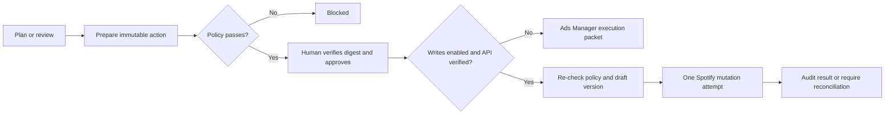

# Spotify Ads Agent

An approval-gated Cloudflare Agent and reusable operator skill for planning, reviewing, and safely carrying out Spotify advertising workflows. Ship empty artist profiles. Operators enter their own IDs, markets, currency, audience, and budget after install.

## Current operating status

- **Direct Spotify API capability:** officially supported by Spotify Ads API v3 for campaign management and reporting.
- **Customer account access:** always unverified until the operator runs spotify/verify with their credentials.
- **Default runtime mode:** `COPILOT`. The agent can plan, ingest data, calculate pacing, and prepare approval packets, but cannot mutate Spotify.
- **Live writes:** require a deployment-level enable switch, successful official API read verification, a policy-passing immutable proposal, a valid approval digest, and a separate approver when configured.
- **Deployment:** not performed. No Spotify account, campaign, or budget was changed.

Verified against Spotify and Cloudflare documentation on **2026-07-21**. See [docs/VERIFICATION.md](docs/VERIFICATION.md) for the evidence and boundaries.

## What is included

- Configurable artist profiles (empty template only — no client data)
- Campaign plans with facts, assumptions, constraints, evidence gaps, and policy warnings
- Audience and creative test briefs
- Manual Ads Manager performance ingestion and official Ads API v3 reporting ingestion
- Deterministic daily/lifetime budget pacing reviews
- Durable per-artist state, SQLite records, evidence-backed learnings, and audit history
- Recurring reviews through Cloudflare Agent schedules
- Draft-first Spotify actions, immutable SHA-256 approval packets, expiry, policy re-checks, and optional distinct approvers
- No automatic retry of non-idempotent Spotify mutations; uncertain outcomes require reconciliation
- Shared-key authentication for local operation and Cloudflare Access identity enforcement for production
- Structured logs, bounded request/response handling, tests, and deployment runbooks
- A reusable `spotify-ads-operator` skill and a small authenticated operator client

## Safety model



Changing `SPOTIFY_WRITE_ENABLED` does not bypass approval. Missing currency or budget ceilings block spend-bearing actions. Publishing or validating a draft also checks that Spotify's current draft hierarchy version still matches the approved version.

## Quick start

Requirements: Node.js 22+, a Cloudflare account for deployment, and—only for official Spotify connectivity—an Ads Manager account plus an ads-enabled Spotify developer app accepted for Ads API use.

```bash
npm ci
cp .dev.vars.example .dev.vars
npm run check
npm run dev
```

Generate a strong local operator key, place it in `.dev.vars`, then initialize an empty profile:

```bash
export AGENT_BASE_URL=http://localhost:8787
export OPERATOR_API_KEY='replace-with-the-local-key-from-.dev.vars'
export OPERATOR_ACTOR='your-verified-operator-identity'

node skill/spotify-ads-operator/scripts/operator.mjs \
  my-artist PUT profile examples/artist.profile.example.json
```

The helper wraps the profile file with the required actor automatically. Inspect status with:

```bash
node skill/spotify-ads-operator/scripts/operator.mjs my-artist GET status
```

Do not fill Spotify ID, markets, currency, or limits until each value has been verified and approved. Full setup is in [docs/SETUP.md](docs/SETUP.md).

## Repository map

| Path | Purpose |
|---|---|
| `src/agent.ts` | Durable per-artist Agent, schedules, records, reviews, proposals, approvals, and audit history |
| `src/spotify/client.ts` | Bounded Spotify OAuth/API connector with read retries and no mutation retries |
| `src/domain/` | Validation, planning, pacing, and approval policy |
| `src/index.ts` | Authenticated HTTP API and structured request logs |
| `skill/spotify-ads-operator/` | Reusable Codex skill, operating rules, references, and client script |
| `test/` | Domain, Worker integration, persistence, approval, and Spotify connector tests |
| `docs/` | Verification, setup, API, architecture, operations, and deployment guides |

## Documentation

- [Verification and current capability boundary](docs/VERIFICATION.md)
- [Setup](docs/SETUP.md)
- [Operator API](docs/API.md)
- [Architecture](docs/ARCHITECTURE.md)
- [Operations and incident handling](docs/OPERATIONS.md)
- [Deployment](docs/DEPLOYMENT.md)
- [Security policy](SECURITY.md)

## Development commands

```bash
npm run typegen   # regenerate Cloudflare binding types
npm run typecheck # TypeScript validation
npm test          # deterministic unit and Worker integration tests
npm run check     # all checks
npm run deploy    # deploy only after completing the deployment gates
```

## Important limits

- This is not a claim that any customer's Ads Manager account has API access until verified.
- The repository does not generate OAuth consent or credentials for you.
- It does not upload media, infer target IDs, manufacture audience facts, or decide business budgets.
- Reporting delivery metrics cannot by itself prove causal lift, listener quality, or revenue impact.
- Cloudflare Access should be mandatory before multiple real operators use the approval workflow; a shared local key alone cannot prove that two human identities are distinct.
- Spotify's current Ads Manager UI can expose features or constraints that differ from the public API. When the API cannot express an action, use the generated packet in Ads Manager and record the result manually.

## License

MIT. Spotify, Cloudflare, and their product names are trademarks of their respective owners; this project is not an endorsement or official integration.
