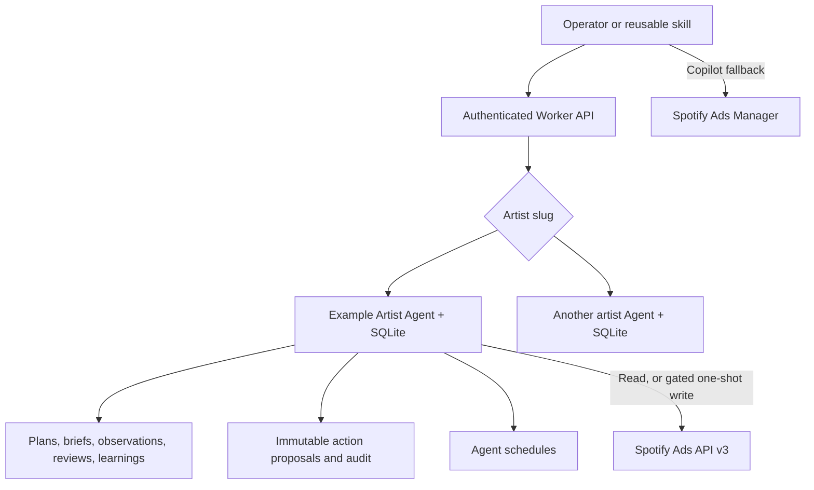
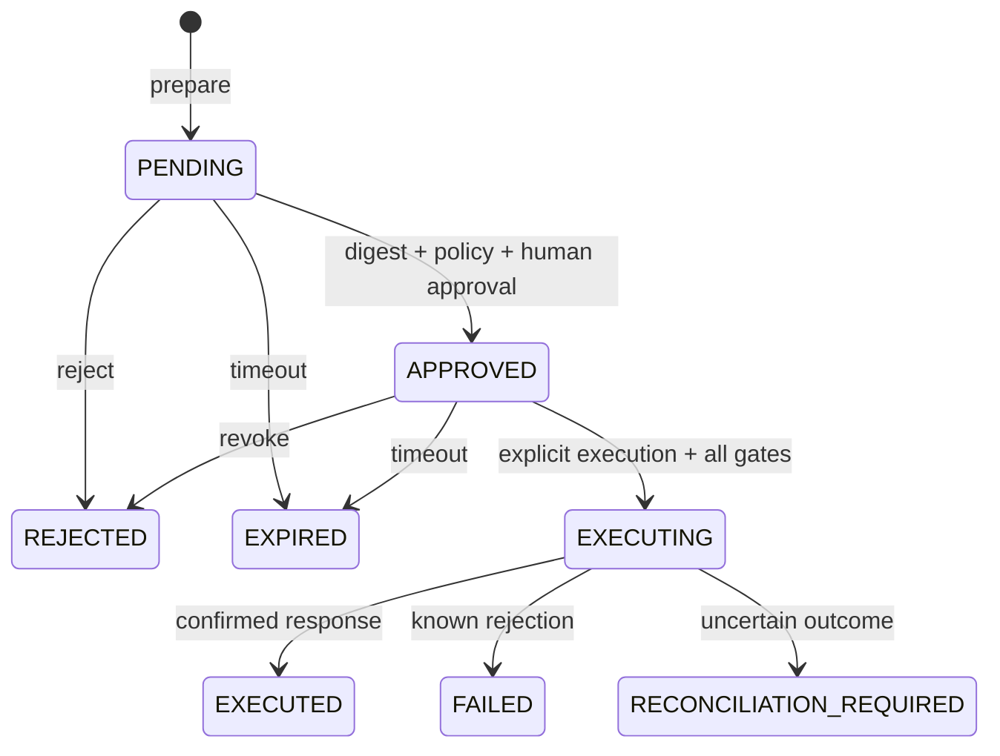

# Architecture

## System boundary

The Worker is an authenticated API gateway. Each artist slug maps to exactly one named `SpotifyAdsAgent`, backed by a SQLite Durable Object. No artist data is shared across objects.

## Durable state

Agent state keeps the current artist profile, API capability status, schedule metadata, and last sync/review timestamps. SQLite keeps append-oriented records:

| Table | Retention cap | Purpose |
|---|---:|---|
| `artifacts` | uncapped in v1 | Campaign plans and audience/creative briefs |
| `observations` | 500 | Provenanced performance snapshots |
| `reviews` | 100 | Deterministic pacing assessments |
| `proposals` | 200 | Approval and execution state machines |
| `learnings` | 200 | Evidence-backed durable artist knowledge |
| `audit_events` | 1,000 | Human- and system-attributed event summaries |

Credentials are never stored in Agent state or SQLite. They are read only from Worker secrets.

## Planning and review

Planning is deterministic and schema-validated; it does not require a model provider. Inputs preserve facts, assumptions, and gaps. Performance reviews calculate flight progress versus spend progress and flag underpacing, overpacing, exhaustion, stalls, and possible frequency fatigue. A review never creates a proposal or mutation by itself.

## Approval state machine

The immutable proposal digest covers the action plus proposal identity and expiry. It prevents an approved packet from being silently substituted.

Non-idempotent Spotify writes receive one attempt. An interrupted Agent restart also converts a sufficiently old `EXECUTING` proposal to `RECONCILIATION_REQUIRED`.

## Spotify connector

- Fixed HTTPS origins and relative paths prevent arbitrary outbound targets.
- OAuth refresh credentials remain in Worker secrets.
- Concurrent reads coalesce one token refresh per client instance.
- GET requests have a small bounded retry budget for network, rate-limit, and server failures.
- POST/PATCH requests are not retried.
- Bodies are schema-checked, response reads are capped at 5 MB, and trace IDs are retained.
- Draft validation/publication reads the current hierarchy version and refuses to execute if it differs from the approved packet.
- Entity budgets are converted from Spotify micro-units to internal currency minor units; aggregate `SPEND` values are converted from major units.

## Authentication and identity

All routes except `/health` require a timing-safe comparison against `OPERATOR_API_KEY`. In production, Cloudflare Access should add the authenticated email header and `REQUIRE_CF_ACCESS=true` should enforce it. Body `actor` fields must then match that identity.

## Failure boundaries

- The public health route proves only that the Worker responds.
- `spotify/verify` proves the configured token can read the configured ad account at that time; it does not promise all writes.
- A prepared or approved proposal is not a Spotify mutation.
- An HTTP success from Spotify is recorded with the trace ID but should still be checked in the product for high-value operations.
- A scheduled review is analytical only.
